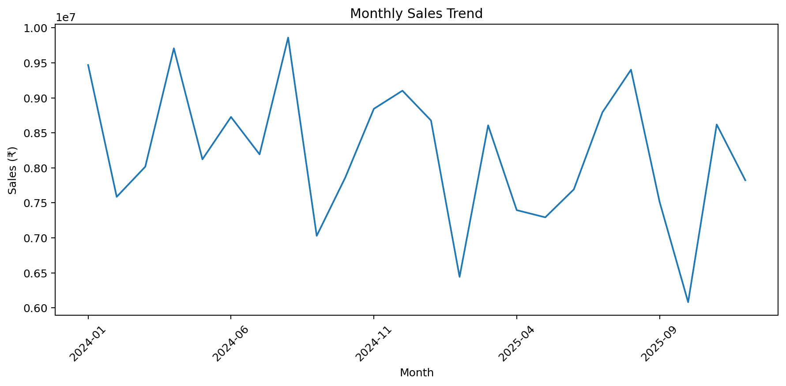
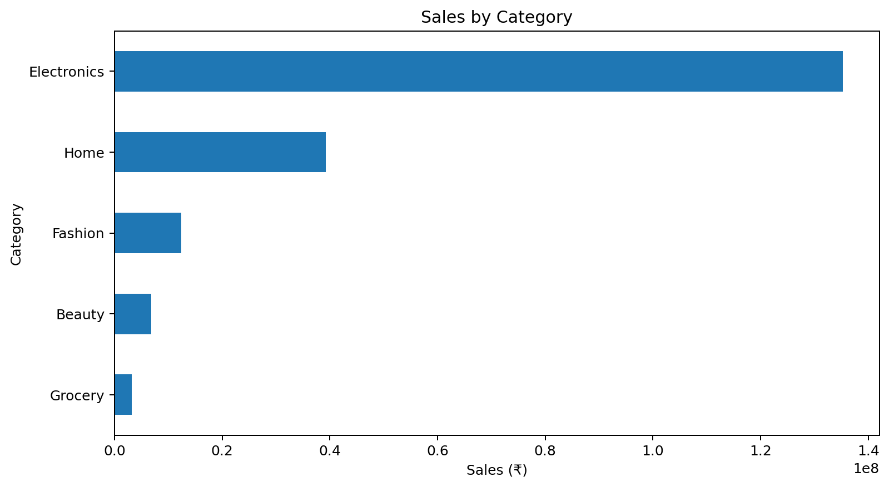
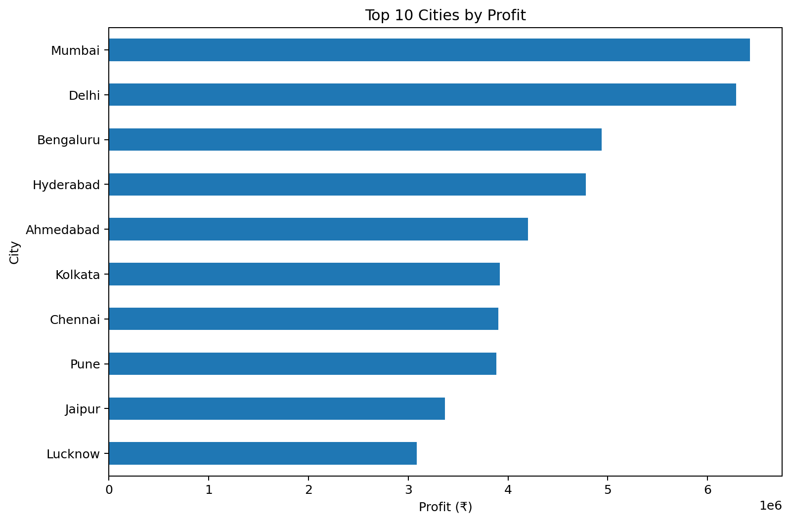
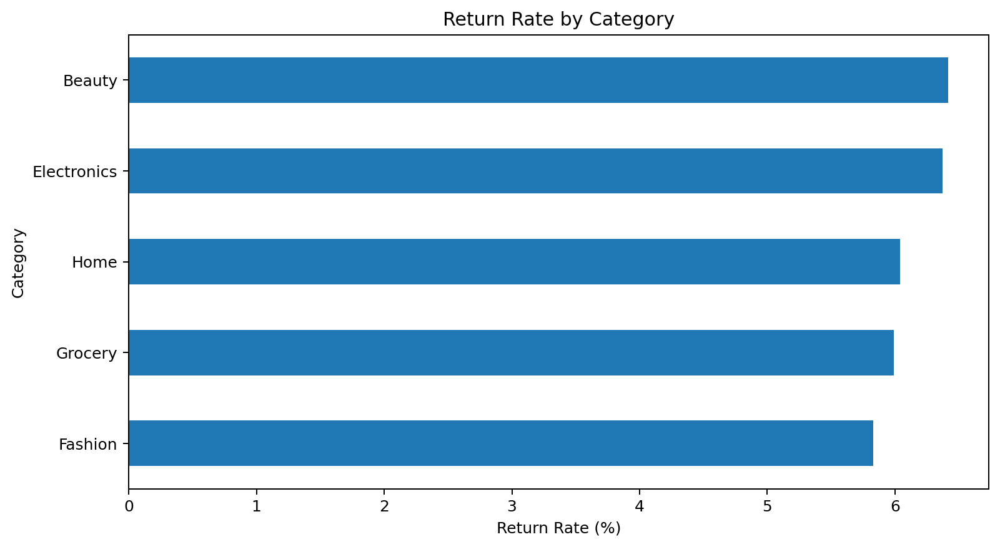
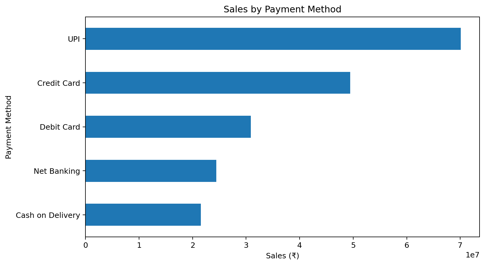
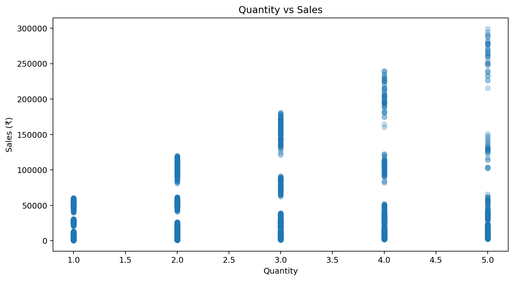

# E-Commerce Analytics with Python 🛒📊

End-to-end e-commerce analytics project using Python, Pandas, NumPy and Matplotlib on a **12,008-row synthetic transaction dataset** representing 12,000 unique orders plus 8 intentional duplicate records.

## Project Overview

**Raw Data → Data Cleaning → KPI Analysis → Customer Analytics → RFM Segmentation → Visualization → Business Insights → CSV Outputs**

## Dataset

- Raw rows: 12,008
- Unique orders: 12,000
- Customer IDs: 3,500 possible customers
- Date range: January 2024 – December 2025
- Multiple product categories, cities, payment methods and order statuses
- Intentional duplicates and missing values are included for cleaning practice
- Dataset is synthetic and created for portfolio/learning purposes

## Analysis Covered

### Business KPIs
- Total sales
- Total profit
- Profit margin
- Average Order Value (AOV)
- Delivered orders
- Unique customers
- Return rate
- Average customer rating

### Product & Category Analysis
- Sales by category
- Profit by category
- Return rate by category
- Average order value

### Geographic Analysis
- Sales by city
- Profit by city
- Top-performing cities

### Customer Analytics
- Customer sales
- Customer profit
- Order frequency
- Average order value

### RFM Customer Segmentation

- **Recency** — how recently a customer purchased
- **Frequency** — number of orders
- **Monetary** — total customer sales

Segments:
- Champions
- Loyal Customers
- New Customers
- Potential Loyalists
- At Risk
- Lost Customers

## Visualizations

### Monthly Sales Trend


### Sales by Category


### Top Cities by Profit


### Return Rate by Category


### Sales by Payment Method


### Quantity vs Sales


## Project Structure

```text
ecommerce-analytics-python/
│
├── ecommerce_data_12000.csv
├── ecommerce_data_cleaned.csv
├── ecommerce_analysis.py
├── ecommerce_visualizations.py
├── requirements.txt
├── README.md
│
├── customer_summary.csv
├── category_summary.csv
├── city_summary.csv
├── monthly_summary.csv
├── payment_summary.csv
├── rfm_summary.csv
│
└── screenshots/
    ├── monthly_sales_trend.png
    ├── sales_by_category.png
    ├── profit_by_city.png
    ├── return_rate_by_category.png
    ├── sales_by_payment_method.png
    └── quantity_vs_sales.png
```

## How to Run

```bash
git clone https://github.com/shivakant-data/ecommerce-analytics-python.git
cd ecommerce-analytics-python
pip install -r requirements.txt
python ecommerce_analysis.py
python ecommerce_visualizations.py
```

## Business Questions Answered

- Which category generates the most sales?
- Which category generates the most profit?
- Which cities contribute the most profit?
- Which category has the highest return rate?
- Which payment method generates the most sales?
- Who are the highest-value customers?
- Which customer segments have the highest monetary contribution?
- How do sales change over time?
- Is order quantity associated with sales value?

## Technologies

Python • Pandas • NumPy • Matplotlib

## Data Note

This dataset is **synthetically generated** for portfolio and learning purposes. It does not represent real customers or transactions.

## Portfolio Skills

- Data cleaning
- Exploratory data analysis
- KPI development
- Customer segmentation
- RFM analysis
- Business analytics
- Data visualization
- Python automation
- CSV reporting
